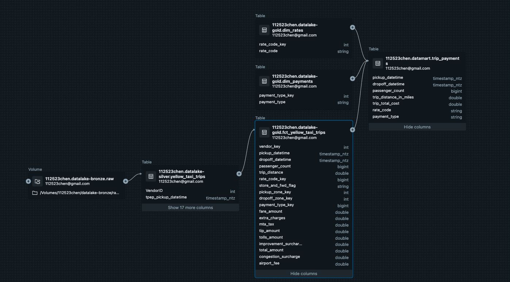

# New York City Taxi Data Pipeline Project

## Introduction

New York City has a large number of taxi cabs that transport people around the city. Local government has been collecting data on taxi trips for years. This data is useful for many purposes, such as traffic planning, taxi dispatching, and fare regulation. In this project, we will build a data pipeline to process the taxi data and provides efficient access to the data for further analysis.

## Data Source

The data source is the New York City Taxi & Limousine Commission (TLC) Trip Record Data. The data is available on the [TLC website](https://www1.nyc.gov/site/tlc/about/tlc-trip-record-data.page). The data is stored as parquet files on an AWS S3 bucket. The data is partitioned by year and month.

## Data Pipeline

The data pipeline consists of the following steps:

1. Download the data from the S3 bucket to Databricks Volumes in the bronze layer.
2. Load the data/files into a Spark DataFrame and save it as a Delta table in the silver layer.
3. Clean the data from the silver layer.
    3.1. Update column names and data types.
    3.2. Remove unnecessary columns.
4. Save facts about trips in a Delta table in the gold layer.
5. Save Payment, Rate, and Zone dimensions in Delta tables in the gold layer.
6. Aggregate data about trip payments and save it in a Delta table in the data mart.

## Data Model

The data model for the lakehouse follows dimensional modeling principles with star schemas. The data model consists of the following tables:

- Facts:
    - trips
- Dimensions:
    - payment
    - rate
    - zone

## Data Mart

The data mart consists of the following tables:

- trips_payment (aggregated data about trip payments)

## Conclusions

In this project, we built a data pipeline to process New York City taxi data. We created a data lakehouse with a dimensional model and a data mart. The data pipeline is automated and can be scheduled to run periodically to update the data in the lakehouse.

## Next Steps

The next steps for this project are:

- Add a machine learning model to predict trip fares.
- Provision mlops to monitor the data pipeline and the machine learning model.
- Create a dashboard to visualize the data.

